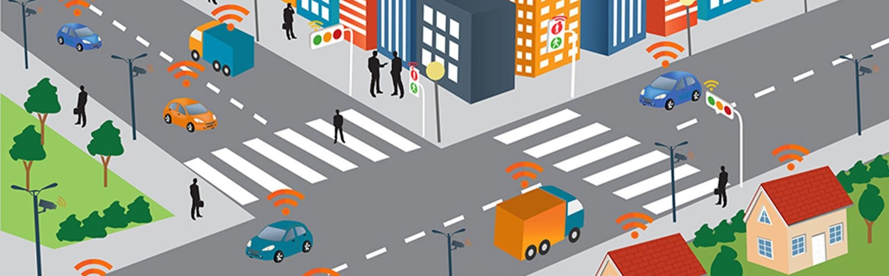

  

# Smart Traffic Management System

## Overview

In the continually advancing sphere of information technology, urban areas worldwide are facing the challenge of traffic congestion, which has far-reaching implications on productivity, air quality, and overall quality of life. This project aims to address traffic congestion through an innovative AI-based traffic management system.

## Team Members
- Thevan Raju A/L Jeganath
- Nurul Erina Binti Zainuddin
- Aliatul Izzah Binti Jasman
- Low Jie Sheng

## 1.0 Problem Background

### 1.1 Introduction
Traffic congestion leads to increased travel times, higher fuel consumption, and significant air pollution. Current traffic management systems often rely on static schedules that do not adapt to real-time conditions.

### 1.2 The Problem Background
Many commuters experience delays due to unpredictable events such as accidents and roadwork, leading to frustration. Efficient traffic management can enhance environmental sustainability, reduce stress, and increase economic productivity.

### 1.3 The Need for an AI Solution
An AI-based solution can analyse traffic density, weather conditions, and incident reports to suggest real-time adjustments, creating a more responsive traffic management system.

## 2.0 Stakeholders/Users
- **Commuters**: Experience delays and travel stress.
- **Traffic Management Authorities**: Oversee traffic flow and safety.
- **Public Transport Operators**: Strive to maintain timely routes.
- **City Planners and Municipalities**: Use data for future infrastructure planning.
- **Environmental Advocates**: Promote solutions to reduce emissions.

## 3.0 System Architecture
The Smart Traffic Management System consists of components designed to collect, process, and act on real-time traffic data.
